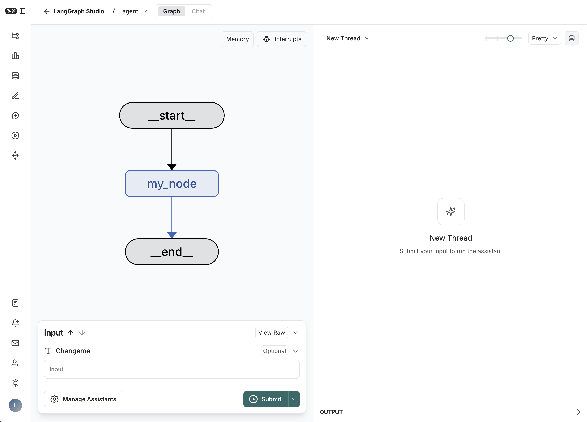

# LangGraph Studio 실행 매뉴얼 (Windows)

로컬에서 만든 LangGraph 그래프를 **LangSmith Studio**(웹 화면)에서 그림으로 보고 실행하는 방법을 정리한 문서입니다.

```
[내 PC]    langgraph dev        ← 그래프 서버가 내 컴퓨터에서 실행됨 (127.0.0.1:2024)
               ↑  접속
[웹]       smith.langchain.com/studio   ← 그래프를 그려주는 화면
```

- 그래프 코드: [src/agent/graph.py](./src/agent/graph.py)
- 서버 설정: [langgraph.json](./langgraph.json), 여기서 `graph` 변수를 등록함

---

## 0. 서버를 꼭 열어야 하나?

**Studio 화면을 쓰려면 서버가 필요합니다.** 그래프 그림이나 실행 기록만 보려면 서버 없이도 됩니다.

| 하고 싶은 것 | 서버 필요 | 방법 |
|---|---|---|
| Studio 화면에서 그래프를 보고 클릭해서 실행 | **필요** | `langgraph dev` (아래 2~3장) |
| 그래프 구조 그림 보기 | 불필요 | 코드로 이미지 생성 (아래 ①) |
| LangSmith 웹에서 실행 기록(trace) 보기 | 불필요 | 환경변수 설정 후 파이썬으로 실행 (아래 ②) |

**① 그래프를 이미지로 저장하기**
```python
from agent.graph import graph
graph.get_graph().draw_mermaid_png(output_file_path="graph.png")
# 또는 print(graph.get_graph().draw_mermaid()) 출력을 https://mermaid.live 에 붙여넣기
```

**② LangSmith에 실행 기록만 남기기**
`.env`에 `LANGSMITH_TRACING=true`와 **유효한** `LANGSMITH_API_KEY`를 넣고, 평소처럼 `graph.invoke(...)`만 실행하면 됩니다. 결과는 smith.langchain.com의 해당 프로젝트에서 노드별 실행 단계로 확인할 수 있습니다.

### 서버를 열면 좋은 점

| 기능 | 서버 없이 | 서버 열면 (Studio) |
|---|---|---|
| 그래프 구조 그림 | 이미지 파일로 생성 | 화면에 바로 표시, 코드 수정 시 자동 갱신 |
| 실행 | 코드에 입력값을 써서 `invoke()` | **화면에서 입력하고 버튼으로 실행** |
| 실행 과정 | 끝난 뒤 LangSmith에서 기록 확인 | **실행 중인 노드를 실시간으로 표시** |
| 중간 상태 확인 | `print()`를 직접 넣어야 함 | 노드마다 state 값을 클릭해서 확인 |
| 중간에 멈추기 | 어려움 | 노드 앞에 **중단점(breakpoint)** 설정 |
| 다시 실행 | 처음부터 다시 | **중간 상태를 수정한 뒤 그 지점부터 재실행** |
| 대화형 에이전트 | 대화 기록을 직접 관리 | thread 단위로 대화 유지, `+` 버튼으로 새 대화 |
| API로 사용 | 없음 | `http://127.0.0.1:2024`로 다른 프로그램이 호출 가능 |

**정리**
- 그래프가 단순하거나 결과만 확인하면 될 때 → **서버 없이** 실행하고 기록만 봐도 충분합니다.
- 노드가 많고 조건 분기나 도구 호출이 있어서 **"어디서 왜 이상해졌지?"를 찾아야 할 때** → **서버를 열고 Studio**를 쓰는 게 훨씬 편합니다.

---

## 1. 최초 1회 준비

### 1-1. 패키지 설치
프로젝트 루트(`D:\Agent_one`)에서 실행합니다.
```bash
uv add "langgraph-cli[inmem]"
```

### 1-2. LangSmith API 키 발급
1. https://smith.langchain.com 에 로그인합니다.
2. **Settings → API Keys**에서 새 키(`lsv2_pt_...`)를 발급합니다.

### 1-3. `.env` 작성
이 폴더에서 `.env.example`을 복사해 `.env`를 만듭니다.
```bash
cp .env.example .env
```
`.env` 내용 예시:
```text
OPENAI_API_KEY=sk-...
LANGSMITH_TRACING=true
LANGSMITH_ENDPOINT=https://api.smith.langchain.com
LANGSMITH_API_KEY=lsv2_pt_...
LANGSMITH_PROJECT=prj-langgraph-langsmith
```
> `.env`는 **git에 커밋하지 마세요.** `.gitignore`에 포함되어 있는지 확인하세요.
> `.env`에 **한글 주석을 쓰지 마세요.** cp949 오류의 원인이 됩니다.

### 1-4. UTF-8 모드 영구 설정
Windows에서는 이 설정이 없으면 `UnicodeDecodeError: 'cp949' codec ...` 오류가 납니다.

| 터미널 | 영구 설정 |
|---|---|
| Git Bash | `echo 'export PYTHONUTF8=1' >> ~/.bashrc && source ~/.bashrc` |
| cmd / PowerShell | `setx PYTHONUTF8 1` 실행 후 **터미널을 새로 열기** |

---

## 2. 실행

이 폴더(`src/langsmith_langgraph`)에서 실행합니다.

```bash
cd D:/Agent_one/src/langsmith_langgraph
langgraph dev
```

PYTHONUTF8을 영구 설정하지 않았다면 실행 명령 앞에 붙입니다.

| 터미널 | 명령 |
|---|---|
| Git Bash | `PYTHONUTF8=1 langgraph dev` |
| cmd | `set PYTHONUTF8=1` 실행 후 `langgraph dev` |
| PowerShell | `$env:PYTHONUTF8="1"; langgraph dev` |

> Git Bash에서 `set PYTHONUTF8=1`은 **동작하지 않습니다.** `export`를 쓰세요.

정상 실행되면 아래처럼 출력됩니다.
```
- 🚀 API: http://127.0.0.1:2024
- 🎨 Studio UI: https://smith.langchain.com/studio/?baseUrl=http://127.0.0.1:2024
```

---

## 3. Studio 접속

### 방법 A: 직접 접속 (권장)
1. 서버를 켜 둔 상태로 **Chrome**에서 엽니다.
   ```
   https://smith.langchain.com/studio/?baseUrl=http://127.0.0.1:2024
   ```
2. **"로컬 네트워크 기기에 액세스"** 팝업이 뜨면 **허용**을 누릅니다.
3. 팝업 없이 실패하면 주소창 왼쪽 아이콘 → **사이트 설정** → **로컬 네트워크 액세스: 허용**으로 바꾸고 새로고침(F5)합니다.
4. Brave를 쓴다면 Shields를 끄고, 광고 차단 확장 프로그램도 꺼 보세요.

### 방법 B: 터널 사용 (방법 A가 안 될 때)
```bash
PYTHONUTF8=1 langgraph dev --tunnel
```
1. 터미널에 출력된 `🎨 Studio UI:` 링크(`https://xxxx.trycloudflare.com`)로 들어갑니다.
2. **"domain ... is not allowed"**가 뜨면 **Advanced Settings**를 펼쳐 허용 도메인에 `xxxx.trycloudflare.com`을 추가하고 **Connect**를 누릅니다.

> 터널 주소는 **실행할 때마다 바뀝니다.** 재실행 후에는 반드시 **새로 출력된 주소**를 사용하세요.

---

## 4. 문제 해결

| 증상 | 원인 | 해결 |
|---|---|---|
| `UnicodeDecodeError: 'cp949' codec can't decode` | Windows 기본 인코딩 문제 | `PYTHONUTF8=1` 설정 ([1-4](#1-4-utf-8-모드-영구-설정)) |
| `set PYTHONUTF8=1` 했는데도 같은 오류 | Git Bash에서 `set`을 사용함 | `export PYTHONUTF8=1` 사용 |
| Studio: **Failed to fetch** | 서버가 꺼져 있음, 또는 브라우저가 localhost 접속을 차단함 | 서버가 켜져 있는지 확인 → [방법 A](#방법-a-직접-접속-권장)의 권한 허용 → 안 되면 방법 B |
| Studio: **domain is not allowed** | 터널 주소가 허용 목록에 없음 | Advanced Settings에서 도메인 추가 |
| 터널로 접속했는데 Failed to fetch | 이전 터널 주소가 이미 만료됨 | 터미널의 **최신** 주소 사용 |
| 로그에 `403 Forbidden` (`api.smith.langchain.com`) | LangSmith API 키가 잘못됐거나 만료됨 | 새 키 발급 후 `.env` 수정, 서버 재시작 |
| 그래프는 보이는데 LangSmith에 실행 기록이 없음 | API 키 문제, 또는 `LANGSMITH_TRACING` 미설정 | `.env` 확인 |
| `langgraph: command not found` | CLI 미설치 또는 가상환경 비활성 | [1-1](#1-1-패키지-설치) 실행, `.venv` 활성화 |

### 서버 상태 확인
```bash
curl http://127.0.0.1:2024/ok
# {"ok":true} 가 나오면 서버 정상
```

### 브라우저 없이 그래프 실행 테스트
```bash
curl -X POST http://127.0.0.1:2024/runs/wait \
  -H "Content-Type: application/json" \
  -d '{"assistant_id":"agent","input":{}}'
```

---

## 5. 그래프 수정
- [src/agent/graph.py](./src/agent/graph.py)에서 노드와 엣지를 수정하면 `langgraph dev`가 **자동으로 다시 불러옵니다(hot reload).**
- 새 그래프를 추가하려면 [langgraph.json](./langgraph.json)의 `graphs`에 `"이름": "./경로/파일.py:변수명"` 형식으로 등록합니다. 경로는 `langgraph.json` 파일 기준입니다.

---

<details>
<summary>원본 템플릿 README (영문)</summary>

# New LangGraph Project

[](https://github.com/langchain-ai/new-langgraph-project/actions/workflows/unit-tests.yml)
[](https://github.com/langchain-ai/new-langgraph-project/actions/workflows/integration-tests.yml)

This template demonstrates a simple application implemented using [LangGraph](https://github.com/langchain-ai/langgraph), designed for showing how to get started with [LangGraph Server](https://langchain-ai.github.io/langgraph/concepts/langgraph_server/#langgraph-server) and using [LangGraph Studio](https://langchain-ai.github.io/langgraph/concepts/langgraph_studio/), a visual debugging IDE.

<div align="center">
  
</div>

The core logic defined in `src/agent/graph.py`, showcases an single-step application that responds with a fixed string and the configuration provided.

You can extend this graph to orchestrate more complex agentic workflows that can be visualized and debugged in LangGraph Studio.

## Getting Started

1. Install dependencies, along with the [LangGraph CLI](https://langchain-ai.github.io/langgraph/concepts/langgraph_cli/), which will be used to run the server.

```bash
cd path/to/your/app
pip install -e . "langgraph-cli[inmem]"
```

2. (Optional) Customize the code and project as needed. Create a `.env` file if you need to use secrets.

```bash
cp .env.example .env
```

If you want to enable LangSmith tracing, add your LangSmith API key to the `.env` file.

```text
# .env
LANGSMITH_API_KEY=lsv2...
```

3. Start the LangGraph Server.

```shell
langgraph dev
```

For more information on getting started with LangGraph Server, [see here](https://langchain-ai.github.io/langgraph/tutorials/langgraph-platform/local-server/).

## How to customize

1. **Define runtime context**: Modify the `Context` class in the `graph.py` file to expose the arguments you want to configure per assistant. For example, in a chatbot application you may want to define a dynamic system prompt or LLM to use. For more information on runtime context in LangGraph, [see here](https://langchain-ai.github.io/langgraph/agents/context/?h=context#static-runtime-context).

2. **Extend the graph**: The core logic of the application is defined in [graph.py](./src/agent/graph.py). You can modify this file to add new nodes, edges, or change the flow of information.

## Development

While iterating on your graph in LangGraph Studio, you can edit past state and rerun your app from previous states to debug specific nodes. Local changes will be automatically applied via hot reload.

Follow-up requests extend the same thread. You can create an entirely new thread, clearing previous history, using the `+` button in the top right.

For more advanced features and examples, refer to the [LangGraph documentation](https://langchain-ai.github.io/langgraph/). These resources can help you adapt this template for your specific use case and build more sophisticated conversational agents.

LangGraph Studio also integrates with [LangSmith](https://smith.langchain.com/) for more in-depth tracing and collaboration with teammates, allowing you to analyze and optimize your chatbot's performance.


</details>
