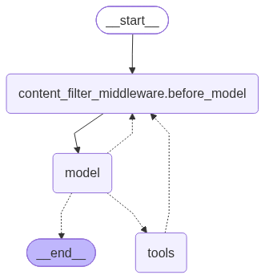

# create_agent + Middleware 예제

| 파일 | 내용 |
|---|---|
| [middleware.py](./middleware.py) | `wrap_model_call`로 대화 길이에 따라 모델을 바꾸는 예제 (+ `MemorySaver`로 대화 기억) |
| [middleware_with_node.py](./middleware_with_node.py) | `before_model`, `dynamic_prompt` 미들웨어 예제 |

## 실행 방법

이 파일들은 `from single_agent...` 형식의 import를 사용하므로, **`src` 폴더에서 모듈로 실행**해야 합니다.

```bash
cd D:/Agent_one/src
python -m single_agent.create_agent.middleware
python -m single_agent.create_agent.middleware_with_node
```

> 파일 경로로 직접 실행하면(`python .../middleware.py`) `ImportError`가 납니다.
> `-m` 뒤에는 **점(.)으로 구분한 모듈 이름**을 쓰고 `.py`는 붙이지 않습니다.

---

## 1. MemorySaver란?

그래프의 **state(대화 메시지 등)를 실행할 때마다 저장해 두는 메모리 저장소**(checkpointer)입니다.
같은 `thread_id`로 다시 호출하면 저장된 state를 불러와 **이전 대화에 이어서** 실행합니다.

```python
from langgraph.checkpoint.memory import MemorySaver

agent = create_agent(model, tools, checkpointer=MemorySaver())   # 괄호 필수!
config = {"configurable": {"thread_id": "user-1"}}

agent.invoke({"messages": [("user", "15와 7을 더해줘")]}, config)
agent.invoke({"messages": [("user", "결과에 3을 곱해줘")]}, config)  # "결과"가 22임을 기억함
```

> `checkpointer=MemorySaver`처럼 **괄호 없이** 넘기면 다음 오류가 납니다.
> `TypeError: Invalid checkpointer provided ... Received ABCMeta`
> 클래스 자체가 아니라 `MemorySaver()`로 만든 **객체**를 넘겨야 합니다.

### 동작 흐름

```
invoke 호출 (thread_id="user-1")
   │
   ├─ ① 불러오기: MemorySaver에서 "user-1"의 마지막 state를 꺼냄 (처음이면 빈 상태)
   │
   ├─ ② 합치기: 기존 messages + 새 질문
   │            (messages는 add_messages reducer라서 덮어쓰지 않고 뒤에 추가됨)
   │
   ├─ ③ 실행: model → tools → model ...
   │          각 단계(super-step)가 끝날 때마다 checkpoint 저장
   │
   └─ ④ 결과 반환. 최종 state는 "user-1"에 저장된 상태로 남음
```

### 저장 구조

```
MemorySaver (파이썬 dict, RAM에 있음)
 ├─ thread_id = "user-1"
 │    ├─ checkpoint 1  (질문만 있음)
 │    ├─ checkpoint 2  (+ AI 도구 호출)
 │    ├─ checkpoint 3  (+ Tool 결과)
 │    └─ checkpoint 4  (+ 최종 답변)   ← 최신
 └─ thread_id = "user-2"
      └─ ...                         ← 서로 완전히 분리됨
```

- **thread_id = 대화방**입니다. 같은 id면 대화가 이어지고, 다른 id면 새 대화입니다.
- 최신 상태만이 아니라 **단계마다 기록**합니다. 그래서 이력 조회와 특정 시점부터 다시 실행할 수 있습니다.

### 자주 쓰는 기능

```python
agent.get_state(config).values["messages"]                   # 현재 대화 내용
list(agent.get_state_history(config))                        # 단계별 전체 이력
agent.invoke(..., {"configurable": {"thread_id": "new"}})    # 새 대화 시작
```

### 주의할 점

| 항목 | 내용 |
|---|---|
| 저장 위치 | **RAM**에 저장되므로 프로그램이 끝나면 **모두 사라짐** |
| 용도 | 개발과 테스트용 |
| 메모리 | thread와 checkpoint가 계속 쌓이기만 하고 자동으로 지워지지 않음 |
| 운영 환경 | `SqliteSaver`(파일), `PostgresSaver`(DB) 같은 영구 저장소 사용 |
| `langgraph dev` | 서버가 저장소를 자체 제공하므로 checkpointer를 넣지 않아도 됨 |

> `MemorySaver`는 `InMemorySaver`의 옛 이름(별칭)이며, 둘은 같은 클래스입니다.

---

## 2. 왜 대화 메시지 수가 4씩 늘어나나? (middleware.py 실행 결과)

```
턴 1: 현재 대화 메시지 수: 1 → 3
턴 2: 현재 대화 메시지 수: 5 → 7
턴 3: 현재 대화 메시지 수: 9 → 11   복잡한 대화 감지: 고급 모델(gpt-4o) 사용
...
```

### 한 턴에 메시지 4개가 생김

계산 도구를 쓰는 질문이면 에이전트는 모델을 **2번** 호출합니다.

```
① HumanMessage   "15와 7을 더해주세요"          ← 사용자 질문
   ── 모델 호출 1번째 (로그: 메시지 수 1) ──
② AIMessage      add(15, 7) 도구 호출          ← 모델이 도구 사용을 결정
③ ToolMessage    "22"                          ← 도구 실행 결과
   ── 모델 호출 2번째 (로그: 메시지 수 3) ──
④ AIMessage      "15와 7을 더하면 22입니다."    ← 최종 답변
```

- `wrap_model_call` 미들웨어는 **모델을 호출할 때마다** 실행됩니다. 그래서 한 턴에 로그가 2번 찍힙니다.
- `MemorySaver`와 같은 `thread_id`를 쓰고 있어서 이전 대화가 **계속 누적**됩니다.

| 턴 | 1번째 호출 | 2번째 호출 | 턴 종료 후 |
|---|---|---|---|
| 1 | 1 | 3 | 4 |
| 2 | 5 | 7 | 8 |
| 3 | 9 | 11 | 12 |
| … | +4 | +4 | +4 |

### "복잡한 대화 감지"가 턴 3부터 뜨는 이유

`middleware.py`의 조건이 `if message_count > 10:`이기 때문입니다.
메시지 수가 11이 되는 턴 3의 2번째 호출부터 gpt-4o로 바뀝니다. 질문이 실제로 복잡해서가 아니라 **대화가 길어져서** 바뀐 것입니다.

> 메시지가 계속 늘어나는 게 부담되면, 오래된 메시지를 잘라 내거나 요약하는 방법을 쓰세요.
> 예: LangChain의 `SummarizationMiddleware`

---

## 3. 그래프 그림에서 model이 자기 자신(또는 before_model)으로 돌아가는 점선

| middleware.py | middleware_with_node.py |
|---|---|
|  |  |

그림에 `model → model` 또는 `model → content_filter_middleware.before_model` 점선이 보입니다.
이 점선은 **실제로 그렇게 실행된다는 뜻이 아니라**, "이런 경우에는 그쪽으로 갈 수도 있다"는 **예비 경로**입니다.

- **실선**: 항상 그 방향으로 이동
- **점선**: 조건에 따라 **갈 수도 있는 후보 경로** (conditional edge)

### 이 경로가 추가되는 코드

`create_agent` 내부 코드(`langchain/agents/factory.py`):

```python
model_to_tools_destinations = ["tools", exit_node]
if response_format or loop_exit_node != "model" or middleware_w_wrap_model_call:
    model_to_tools_destinations.append(loop_entry_node)   # ← 루프 시작점으로 돌아가는 경로
```

`wrap_model_call` 미들웨어가 있으면, model 다음에 갈 수 있는 곳에 **루프 시작점**이 추가됩니다.

| 파일 | 루프 시작점 | 그림에 보이는 모양 |
|---|---|---|
| middleware.py (`@wrap_model_call`) | `model` 자신 | model → model |
| middleware_with_node.py (`@before_model` + `@dynamic_prompt`) | `content_filter_middleware.before_model` | model → before_model |

> `@dynamic_prompt`는 내부적으로 `wrap_model_call`로 구현되어 있어서 같은 조건에 해당합니다.

### 실제로 이 경로를 타는 경우

model 다음에 어디로 갈지는 이 순서로 결정됩니다.

1. 미들웨어가 `jump_to="model"`을 지정했으면 → **model로 돌아감**
2. 도구 호출이 없으면 → `__end__`
3. 아직 실행하지 않은 도구 호출이 있으면 → `tools`
4. 도구 호출은 있는데 미들웨어가 가짜 ToolMessage를 미리 넣어서 실행할 도구가 남지 않았으면 → **model로 돌아감**

즉 **미들웨어가 흐름에 끼어들 때를 대비해** 열어 둔 경로입니다. LangChain은 미들웨어가 내부에서 무엇을 할지 미리 알 수 없어서, 이 경로를 항상 그려 둡니다.

**지금 코드에서는** `dynamic_model_selection`이 모델만 바꾸고 `jump_to`도 메시지 주입도 하지 않습니다. 그래서 실제 흐름은 항상 다음과 같습니다.
```
model → tools → model → __end__
```

> `middleware_with_node.py`의 `tools → before_model` 점선은 성격이 다릅니다.
> 도구 실행 후 모델을 다시 부르기 전에 **매번 before_model 필터를 거친다**는 뜻이고, 실제로 그렇게 실행되는 경로입니다.

### 버전에 따라 그림이 다름 (langchain 1.4.0에서 변경)

PyPI의 버전별 `create_agent` 코드를 비교한 결과입니다(이 프로젝트는 **1.4.3** 사용).

| 버전 | model 다음에 루프 시작점이 추가되는 조건 |
|---|---|
| 1.0.0 ~ 1.3.0 | `response_format` 사용 **또는** `after_model` 미들웨어 있음 |
| **1.4.0부터** | 위 조건 **또는 `wrap_model_call` 미들웨어 있음** ← 새로 추가됨 |

```python
# 1.3.0
if response_format or loop_exit_node != "model":
# 1.4.0 이후
if response_format or loop_exit_node != "model" or middleware_w_wrap_model_call:
```

따라서 **1.3.x 이하에서는 같은 코드라도 이 점선이 나타나지 않습니다.** 강의 자료나 블로그의 그림과 모양이 다르다면 버전 차이 때문입니다. 실제 실행 흐름에는 영향이 없습니다.

설치된 버전 확인:
```bash
python -c "import langchain; print(langchain.__version__)"
```

---

## 4. model로 돌아가면 무한 루프가 생기지 않나?

### 기본 동작에서는 생기지 않음
`model → model`로 돌아가는 경우는 `jump_to="model"`을 지정했거나, 가짜 ToolMessage가 들어간 경우뿐입니다.
model이 다시 호출되면 **새 AIMessage**가 만들어지고, 다음 판단은 이 새 메시지를 기준으로 합니다. 도구 호출이 없으면 `__end__`, 있으면 `tools`로 가므로 루프가 끝납니다.

### 미들웨어를 잘못 짜면 생길 수 있음
조건 없이 매번 `jump_to="model"`을 지정하거나, 모델이 도구를 끝없이 호출하면 반복됩니다.

### 안전장치: recursion_limit
LangGraph는 한 번 실행할 때 거칠 수 있는 **단계(super-step) 수에 상한**이 있고, 넘으면 `GraphRecursionError`가 납니다.
하지만 지금 버전에서는 한도가 매우 큽니다.

| 항목 | 값 |
|---|---|
| `create_agent` 기본값 | `recursion_limit = 9_999` |
| LangGraph 기본값 | 10007 (환경변수 `LANGGRAPH_DEFAULT_RECURSION_LIMIT`) |
| 예전 기본값 | 25 |

→ 루프가 생기면 **멈추기 전에 API 비용이 많이 나올 수 있습니다.** 직접 제한하는 것을 권장합니다.

```python
# ① 실행할 때 단계 수 제한
agent.invoke({"messages": [...]}, config={"recursion_limit": 25, **config})

# ② 모델 호출 횟수 제한 미들웨어
from langchain.agents.middleware import ModelCallLimitMiddleware
create_agent(..., middleware=[ModelCallLimitMiddleware(run_limit=10), ...])

# ③ 도구 호출 횟수 제한
from langchain.agents.middleware import ToolCallLimitMiddleware
```
> ②와 ③은 클래스 이름만 확인했습니다. 정확한 인자는 사용 전에 확인하세요.
> `jump_to`를 쓰는 미들웨어를 만든다면, 몇 번 돌아갔는지 state에 세어 두고 일정 횟수가 넘으면 멈추는 조건을 넣으세요.

---

## 5. 도구 호출도 recursion_limit을 차지하나?

**차지합니다.** 노드 하나가 아니라 **단계(super-step) 하나마다 1씩** 셉니다.

```
middleware.py 한 턴
step 1: model   (도구 호출 결정)
step 2: tools   (add 실행)
step 3: model   (최종 답변)          → 3 step

middleware_with_node.py 한 턴
before_model → model → tools → before_model → model   → 5 step
```

- `wrap_model_call`, `dynamic_prompt`는 model 노드 **안에서** 실행되므로 단계 수를 늘리지 않습니다.
- `before_model`, `after_model`은 **별도 노드**라서 각각 1 step으로 셉니다.

| 상황 | 단계 수 |
|---|---|
| 도구 1개 호출 | tools 1 step |
| 모델이 **도구 3개를 한 번에** 호출 | 동시에 실행되므로 **tools 1 step** |
| 도구를 3번에 나눠 호출 (model→tools 반복) | **6 step** |
| **턴이 바뀔 때** (`invoke`를 새로 호출) | **0부터 다시 셈** |

> `MemorySaver` 때문에 **메시지는 턴마다 누적**되지만, **recursion_limit은 `invoke` 한 번 단위로 셉니다.**
> 그래서 대화가 길어져도 한도에 걸리지 않고, **한 번의 질문 안에서** model과 tools를 너무 많이 오갈 때만 걸립니다.
> 예: `recursion_limit=25`이고 미들웨어 노드가 없으면, 한 질문 안에서 도구를 약 12번까지 순차 호출할 수 있습니다.

---

## 6. `@wrap_model_call` 데코레이터의 역할

**모델을 호출하는 순간을 감싸서, 호출 직전과 직후에 원하는 코드를 끼워 넣게 해 주는 데코레이터**입니다.
일반 함수를 에이전트용 미들웨어 객체로 바꿔 주기 때문에 `create_agent(middleware=[...])`에 바로 넣을 수 있습니다.

### 동작 구조

```
에이전트가 model 노드 실행
   │
   └─▶ dynamic_model_selection(request, handler)   ← 내가 만든 함수
          │
          │  ① 호출 전: request(메시지, 모델, 도구, 프롬프트)를 보고 바꿀 수 있음
          │
          ├─▶ handler(request)  ── 실제 모델 호출 (LLM API)
          │
          │  ② 호출 후: 응답(ModelResponse)을 보고 바꿀 수 있음
          │
          └─▶ return 응답
```

| 인자 | 의미 |
|---|---|
| `request: ModelRequest` | 이번 호출에 쓸 정보: `model`, `messages`, `tools`, `system_prompt`, `state` 등 |
| `handler` | 실제로 모델을 호출하는 함수. 이걸 호출해야 모델이 실행됨 |

### middleware.py에서 하는 일

```python
@wrap_model_call
def dynamic_model_selection(request: ModelRequest, handler) -> ModelResponse:
    message_count = len(request.state["messages"])     # ① 호출 전: 상태 확인
    model = advanced_model if message_count > 10 else basic_model
    return handler(request.override(model=model))     # 모델만 바꿔서 실제 호출
```

`request.override(model=...)`는 **원래 request는 그대로 두고 모델만 바꾼 복사본**을 만듭니다.

### 활용 예

handler를 **언제, 몇 번, 무엇으로** 부를지 직접 정할 수 있습니다.

| 용도 | 방법 |
|---|---|
| 모델 바꾸기 | `request.override(model=...)` (middleware.py) |
| 프롬프트·도구 바꾸기 | `override(system_prompt=...)`, `override(tools=[...])` |
| 재시도 | `handler(request)`가 실패하면 다시 호출 |
| 대체 모델 | 기본 모델이 실패하면 다른 모델로 `handler` 호출 |
| 캐시 | 같은 질문이면 handler를 부르지 않고 저장된 응답 반환 |
| 로깅·시간 측정 | handler 앞뒤로 시간과 토큰 수 기록 |

### 응답(ModelResponse)을 받아서 가공하기

`handler(request)`를 바로 `return`하지 않고 **변수에 받아 두면**, 응답을 검사하거나 수정한 뒤에 반환할 수 있습니다.
반환한 응답이 state의 messages에 저장되고, 다음에 어디로 갈지(tools 또는 `__end__`)도 그 응답을 기준으로 결정됩니다.

```python
class ModelResponse:
    result: list[BaseMessage]       # 보통 [AIMessage] 하나
    structured_response: ... | None # response_format을 쓸 때만 값이 있음
```

```python
@wrap_model_call
def dynamic_model_selection(request: ModelRequest, handler) -> ModelResponse:
    model = advanced_model if len(request.state["messages"]) > 10 else basic_model

    response = handler(request.override(model=model))   # ① 실제 호출 결과 받기

    ai_msg = response.result[-1]                          # ② AIMessage 꺼내기
    print("사용 토큰:", ai_msg.usage_metadata)            #    로깅

    if not ai_msg.tool_calls:                             # ③ 최종 답변일 때만 수정
        new_msg = ai_msg.model_copy(update={"content": ai_msg.content + "\n\n(자동 생성된 답변입니다)"})
        return ModelResponse(result=[new_msg])            # ④ 수정한 응답 반환

    return response                                       # 도구 호출이면 그대로 반환
```
> 이 예시는 `ModelResponse` 구조만 확인하고 작성했으며, 직접 실행해 보지는 않았습니다.

| 하고 싶은 것 | 방법 |
|---|---|
| 답변 내용 수정 | `content`를 바꾼 새 AIMessage로 `ModelResponse`를 만들어 반환 |
| 품질 검사 후 재시도 | 응답이 비었거나 형식이 틀리면 `handler(request)`를 다시 호출 |
| 금지어 필터링 | 응답에 금지어가 있으면 다른 내용으로 바꿔서 반환 |
| 토큰과 비용 기록 | `ai_msg.usage_metadata` 확인 |
| 도구 호출 막기 | `tool_calls`에서 특정 도구를 빼고 반환 |

**주의할 점**
- **반환한 내용이 그대로 대화 기록에 남습니다.** 수정한 답변이 MemorySaver에 저장되고, 다음 턴에 모델에게도 그대로 전달됩니다.
- **`tool_calls`를 함부로 건드리면 안 됩니다.** 다음 단계가 tools로 갈지 끝날지가 바뀝니다.
- **메시지는 직접 수정하지 말고 `model_copy(update=...)`로 복사본을 만드세요.**
- **반환 형식은 항상 `ModelResponse`여야 합니다.** 문자열이나 AIMessage를 그대로 반환하면 안 됩니다.

### 다른 미들웨어와의 차이

| 데코레이터 | 실행 시점 | 그래프 노드 | 할 수 있는 것 |
|---|---|---|---|
| `@before_model` | 모델 호출 **전** | **별도 노드** | state 수정, `jump_to` |
| `@after_model` | 모델 호출 **후** | **별도 노드** | 응답 검사, `jump_to` |
| `@wrap_model_call` | 호출 **전후를 감쌈** | model 노드 **안** | 호출 자체를 제어(바꾸기, 재시도, 건너뛰기) |
| `@dynamic_prompt` | 호출 전 | model 노드 안 | 시스템 프롬프트만 바꿈 (`wrap_model_call`을 단순하게 만든 버전) |

> `before_model`과 `after_model`은 **상태를 다루는** 미들웨어이고, `wrap_model_call`은 **모델 호출 그 자체를 다루는** 미들웨어입니다.
> 노드가 따로 생기지 않으므로 recursion_limit 단계 수도 늘리지 않습니다([5장](#5-도구-호출도-recursion_limit을-차지하나)).

---

## 요약

| 주제 | 핵심 |
|---|---|
| `@wrap_model_call` | 모델 호출 전후를 감싸는 미들웨어. `handler(request.override(...))`로 모델·프롬프트·도구를 바꿔 호출하고, 받은 `ModelResponse`를 가공해 반환할 수도 있음. model 노드 안에서 실행 |
| 실행 | `src`에서 `python -m single_agent.create_agent.middleware` |
| `MemorySaver` | `MemorySaver()`로 **객체**를 넘김. `thread_id`별로 RAM에 state 저장. 개발용 |
| 메시지 수 +4 | 질문 → AI(도구 호출) → Tool → AI(답변). 모델 호출은 한 턴에 2번 |
| gpt-4o 전환 | `message_count > 10` 조건 때문. 질문이 복잡해서가 아니라 대화가 길어져서 |
| model→model 점선 | langchain **1.4.0+**에서 `wrap_model_call`이 있으면 그려지는 **예비 경로**. 실제 흐름은 그대로 |
| 무한 루프 | 기본 동작에서는 없음. 기본 recursion_limit이 9,999로 커서 **직접 제한 권장** |
| recursion_limit | **super-step 단위**, `invoke`마다 초기화. 도구 동시 호출은 1 step |
