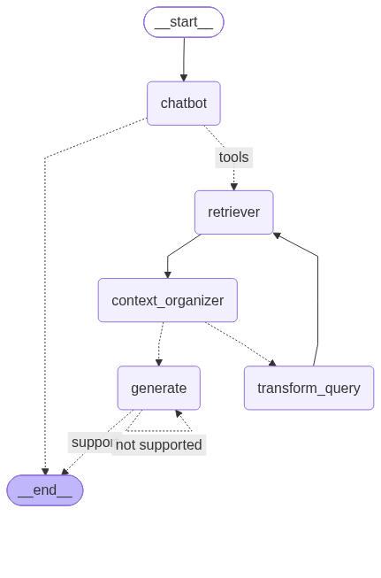

# RAG Agent (LangGraph)

**「한글 맞춤법 · 표준어 규정 해설」 PDF**를 Chroma 벡터 DB에서 검색해 답하는 LangGraph 기반 **자기 교정(Self-Corrective) RAG** 에이전트입니다.

검색 후 바로 답하지 않고, 두 번의 LLM 평가로 품질을 확인합니다.

1. **문서 관련성 평가** — 검색 결과가 질문과 관련 없으면 질문을 고쳐 써서 다시 검색합니다. (최대 3회)
2. **답변 생성** — 출처(페이지 번호)를 함께 적습니다.
3. **환각 평가** — 답변이 문서에 근거하지 않으면 다시 생성합니다.



---

## 목차

- [1. 파일 구성](#1-파일-구성)
- [2. 빠른 시작](#2-빠른-시작)
- [3. 벡터 DB 만들기 (인덱싱)](#3-벡터-db-만들기-인덱싱)
  - [3-1. `collection_name`이란?](#3-1-collection_name이란)
- [4. 전체 흐름](#4-전체-흐름)
- [5. State — `state.py`](#5-state--statepy)
- [6. 검색기 — `retriever.py`](#6-검색기--retrieverpy)
- [7. 노드 — `nodes.py`](#7-노드--nodespy)
- [8. 조건부 엣지 — `edges.py`](#8-조건부-엣지--edgespy)
- [9. 그래프 조립과 실행 — `agent.py`](#9-그래프-조립과-실행--agentpy)
- [10. 실행 예시: State 변화 추적](#10-실행-예시-state-변화-추적)
- [11. 주의할 점 / 개선 포인트](#11-주의할-점--개선-포인트)

---

## 1. 파일 구성

```
rag_agent/
├── agent.py                  # 그래프 조립 · 컴파일 · 실행
├── state.py                  # AgentState 정의
├── nodes.py                  # 노드: chatbot, retrieve, context_organizer, transform_query, generate
├── edges.py                  # 조건부 엣지: decide_to_generate, check_halucinations
├── retriever.py              # Chroma 연결, retriever / retriever_tool 생성
├── vector_retriever.ipynb    # PDF → 청크 → 임베딩 → Chroma 저장 (인덱싱)
├── graph_rag_agent.png       # agent.py 실행 시 자동 저장되는 그래프 그림
├── data/
│   └── 한글맞춤법 표준어규정 해설.pdf   # 원본 문서 (264페이지)
└── database/
    └── chroma_db/            # 벡터 DB (컬렉션: korean_pdf)
```

모듈 의존 관계:

```
agent.py
 ├── state.py
 ├── nodes.py ──┬── retriever.py
 │              └── state.py
 └── edges.py
```

---

## 2. 빠른 시작

### 2-1. 환경 변수

프로젝트 루트(`D:/agent`)의 `.env`에 OpenAI 키를 넣습니다. 임베딩(`text-embedding-3-small`)과 LLM(`gpt-4o`) 모두 OpenAI를 씁니다.

```
OPENAI_API_KEY=sk-...
```

`load_dotenv()`는 현재 폴더부터 상위 폴더로 올라가며 `.env`를 찾으므로 루트의 `.env`가 읽힙니다.

### 2-2. 필요한 패키지

| 용도 | 패키지 |
|---|---|
| 에이전트 실행 | `langgraph`, `langchain-core`, `langchain-openai`, `langchain-chroma`, `python-dotenv`, `pydantic` |
| 인덱싱 노트북 | 위 패키지 + `langchain-community`, `langchain-text-splitters`, `pypdf` |

### 2-3. 실행

```bash
cd D:/agent
python src/single_agent/rag_agent/agent.py
```

- 코드가 `from state import ...`처럼 **같은 폴더 기준 import**를 쓰므로 `python 파일경로`로 실행해야 합니다. `python -m ...` 방식은 `ModuleNotFoundError`가 납니다.
- DB 경로는 `retriever.py` 파일 위치 기준(`Path(__file__)`)이라, 어느 폴더에서 실행해도 항상 `rag_agent/database/chroma_db`를 엽니다.

검색기만 따로 테스트:

```bash
python src/single_agent/rag_agent/retriever.py
```

---

## 3. 벡터 DB 만들기 (인덱싱)

[vector_retriever.ipynb](./vector_retriever.ipynb)를 위에서부터 실행합니다.

| 단계 | 코드 | 결과 |
|---|---|---|
| 1. PDF 로드 | `PyPDFLoader("data/한글맞춤법 표준어규정 해설.pdf")` + `alazy_load()` | 264페이지 → `Document` 264개 (`metadata["page"]`는 **0부터**) |
| 2. 청크 분할 | `RecursiveCharacterTextSplitter(chunk_size=500, chunk_overlap=50)` | 청크 510개 |
| 3. 임베딩 + 저장 | `Chroma.from_documents(...)` | `database/chroma_db`의 `korean_pdf` 컬렉션 |
| 4. 확인 | `vectorstore.similarity_search("구개음화", k=3)` | 검색 결과 3건 |

```python
DB_PATH = Path.cwd() / "database" / "chroma_db"
vectorstore = Chroma.from_documents(
    documents=docs,
    embedding=OpenAIEmbeddings(model="text-embedding-3-small"),  # retriever.py와 같은 모델
    persist_directory=DB_PATH,                                    # retriever.py와 같은 위치
    collection_name="korean_pdf",                                 # retriever.py와 같은 이름
)
```

**인덱싱과 검색이 맞아야 하는 세 가지**: 임베딩 모델, 저장 경로, 컬렉션 이름. 하나라도 다르면 검색 결과가 0건이거나 엉뚱하게 나옵니다.

> - 노트북에는 `__file__`이 없어 `Path.cwd()`를 씁니다. Jupyter(VS Code 포함)는 기본적으로 노트북이 있는 폴더를 작업 폴더로 쓰므로 `retriever.py`와 같은 위치가 됩니다. 설정을 바꿨다면 `os.getcwd()`로 먼저 확인하세요.
> - `Chroma.from_documents`는 기존 컬렉션에 **덧붙입니다**. 다시 만들 때는 `database/chroma_db` 폴더를 지우고 저장 셀을 **한 번만** 실행하세요. (현재 DB 상태는 [11번](#11-주의할-점--개선-포인트) 참고)
> - `nodes.retrieve`가 `doc.metadata['page']`를 읽으므로 metadata에 `page` 키가 꼭 있어야 합니다. `PyPDFLoader`가 자동으로 넣어 줍니다.

### 3-1. `collection_name`이란?

Chroma DB 안에서 데이터를 나눠 담는 **이름표**로, RDB의 **테이블 이름**에 해당합니다. 한 `persist_directory` 안에 여러 컬렉션을 둘 수 있고, 검색은 지정한 컬렉션 안에서만 일어납니다.

```
database/chroma_db/          ← persist_directory
 ├── korean_pdf              ← 이 프로젝트가 쓰는 컬렉션
 ├── (다른 문서용 컬렉션)
 └── langchain               ← collection_name을 안 주면 쓰이는 기본 이름
```

**임베딩 값에는 영향이 없습니다.** 벡터는 `embedding_function`(여기서는 `text-embedding-3-small`)이 만들고, 컬렉션 이름은 그 벡터를 *어디에 넣을지*만 정합니다. 다만 아래 경우에는 검색 결과가 달라집니다.

| 주의할 점 | 내용 |
|---|---|
| 컬렉션 하나 = 임베딩 모델 하나 | 기존 컬렉션에 다른 모델로 넣으면 차원이 다를 때 dimension mismatch 에러가 납니다. 차원이 같으면 에러 없이 서로 다른 벡터 공간이 섞여 검색이 엉망이 됩니다. 모델을 바꾸면 컬렉션 이름도 새로 짓습니다. (예: `korean_pdf_bge_m3`) |
| 같은 이름 = 덧붙이기 | 같은 이름으로 `from_documents`를 다시 실행하면 중복이 쌓입니다. ([11번](#11-주의할-점--개선-포인트)의 1020개 문제) 다시 만들려면 `vectorstore.delete_collection()`을 쓰거나 `ids=`를 지정해 덮어씁니다. |
| 거리 계산 방식은 생성 시점에 고정 | `collection_metadata={"hnsw:space": "cosine"}`(기본값 `l2`)은 컬렉션을 **처음 만들 때만** 적용됩니다. 벡터는 같아도 유사도 점수와 순위가 달라집니다. |

#### 이름을 직접 지정하면 좋은 점

| 장점 | 설명 |
|---|---|
| 데이터 격리 | 여러 노트북이나 실험이 같은 DB를 써도 문서가 기본 `langchain` 컬렉션 하나에 섞이지 않습니다. |
| 재사용 | 다음 실행 때 이름만으로 다시 열 수 있어 임베딩을 다시 하지 않아도 됩니다. (API 비용·시간 절약) `retriever.py`가 바로 이 방식입니다. |
| 실험 비교 | `korean_pdf_chunk500`, `korean_pdf_chunk1000`처럼 설정별로 컬렉션을 나눠 같은 질문으로 검색 품질을 비교할 수 있습니다. |
| 부분 관리 | `delete_collection()`으로 해당 데이터만 지우고 다시 만들 수 있습니다. |
| 라우팅 / 멀티 툴 | 문서 종류별로 컬렉션을 나누고, 질문 유형에 따라 다른 retriever로 보내거나 에이전트에게 컬렉션별 검색 tool을 줄 수 있습니다. |

> 메모리에서 한 번 쓰고 버리는 테스트라면 지정하지 않아도 되지만, `persist_directory`로 저장하거나 데이터 소스가 여러 개라면 항상 지정합니다.

#### 컬렉션으로 나눌까, metadata로 나눌까

데이터를 구분하는 방법은 두 가지입니다.

| 방법 | 언제 쓰나 | 예 |
|---|---|---|
| **컬렉션 분리** | 임베딩 모델·거리 방식·청크 설정이 다를 때, 또는 서로 **절대 같이 검색할 일이 없을 때** | `korean_pdf` / `legal_docs` |
| **metadata + `filter`** | 같은 모델로 임베딩했고, 상황에 따라 **좁혀서도, 전체로도** 검색해야 할 때 | `{"category": "음운"}` |

```python
# 한 컬렉션 안에서 metadata로 범위 좁히기
retriever = vectorstore.as_retriever(
    search_kwargs={"k": 3, "filter": {"category": "음운"}}
)
```

#### 온톨로지 연결 아이디어 (향후 확장)

온톨로지(개념과 개념 사이의 관계 구조)와 연결하려면, **개념 분류는 컬렉션보다 metadata로 붙이는 편이 유리합니다.** 개념에는 상하위 관계가 있어 "구개음화만" 검색할 때도, "음운 현상 전체"를 검색할 때도 있기 때문입니다. 컬렉션으로 쪼개면 위 단계 개념으로 검색할 때 여러 컬렉션을 합쳐야 합니다.

```
음운 현상 (onto:PhonologicalRule)
 ├── 구개음화 (onto:Palatalization)
 ├── 두음 법칙 (onto:InitialSoundRule)
 └── 사이시옷 (onto:Saisiot)
```

1. **인덱싱 시 개념 태깅** — 청크마다 온톨로지 개념 ID를 metadata로 붙입니다. 예: `{"page": 12, "concept": "onto:Palatalization", "parent": "onto:PhonologicalRule"}`. 태깅은 LLM 분류나 키워드 매칭으로 할 수 있습니다.
2. **질문 → 개념 매핑 → 필터 검색** — 질문에서 개념을 찾은 뒤, 온톨로지에서 하위 개념까지 펼쳐 `filter={"concept": {"$in": [...]}}`로 검색합니다.
3. **그래프 + 벡터 결합(GraphRAG)** — 벡터 검색으로 찾은 청크의 `concept` ID로 온톨로지 그래프를 따라가 관련 개념(예: 구개음화 ↔ 표준 발음법 규정)의 청크를 추가로 가져옵니다. 현재 `transform_query` 재검색 루프 대신, 또는 그 앞 단계에 넣을 수 있습니다.
4. **컬렉션 분리는 경계에서만** — 문서 출처나 임베딩 모델이 다른 데이터(예: 맞춤법 해설 vs 국어사전)만 컬렉션으로 나누고, 온톨로지 개념 ID를 공통 키로 써서 컬렉션 사이를 연결합니다.

---

## 4. 전체 흐름

```
            START
              │
              ▼
         ┌─────────┐   도구 호출 없음 (일반 대화)
         │ chatbot │ ─────────────────────────────▶ END
         └─────────┘
              │ 도구 호출 있음 (tools_condition → "tools")
              ▼
         ┌───────────┐
   ┌───▶ │ retriever │  (nodes.retrieve)
   │     └───────────┘
   │          │
   │          ▼
   │  ┌───────────────────┐
   │  │ context_organizer │
   │  └───────────────────┘
   │          │
   │          ▼  decide_to_generate (문서 관련성 평가)
   │     ┌────┴──────────────┐
   │   "no"                "yes" 또는 retry_num ≥ 3
   │     ▼                    ▼
   │ ┌─────────────────┐  ┌──────────┐ ◀──┐
   └─│ transform_query │  │ generate │    │ "not supported"
     └─────────────────┘  └──────────┘ ───┘
                               │ check_halucinations (환각 평가)
                               │ "support"
                               ▼
                              END
```

| 단계 | 종류 | 하는 일 | LLM 호출 |
|---|---|---|---|
| `chatbot` | 노드 | 검색이 필요한 질문인지 판단 (도구 호출 여부) | O |
| `retriever` | 노드 | Chroma에서 상위 3개 문서 검색, 페이지 번호 붙이기 | X (임베딩만) |
| `context_organizer` | 노드 | 검색 결과의 공백·정렬 정리 | O |
| `decide_to_generate` | 엣지 | 문서가 질문과 관련 있는지 yes/no | O |
| `transform_query` | 노드 | 검색에 맞게 질문 재작성, `retry_num` +1 | O |
| `generate` | 노드 | 출처 포함 답변 생성 (재시도 3회 이상이면 "대체 질문 추천" 모드) | O |
| `check_halucinations` | 엣지 | 답변이 문서에 근거하는지 yes/no | O |

---

## 5. State — `state.py`

```python
from langgraph.graph import MessagesState

class AgentState(MessagesState):
    question: str
    context: str
    answer: str
    retry_num: int
```

| 필드 | 쓰는 곳 | 설명 |
|---|---|---|
| `messages` | 모든 노드 | `MessagesState`에서 상속. 대화 기록 |
| `question` | `chatbot`이 설정, `transform_query`가 덮어씀 | 현재 검색·평가에 쓰는 질문 |
| `context` | `retrieve`가 설정, `context_organizer`가 덮어씀 | 검색된 문서 (페이지 번호 포함) |
| `answer` | `generate` | 생성된 답변. 환각 평가에 사용 |
| `retry_num` | `transform_query` | 질문을 다시 쓴 횟수. 무한 재검색 방지 |

### Reducer — 덮어쓰기 vs 이어 붙이기

노드는 **바꿀 키만 담은 dict**를 반환하고, LangGraph가 필드별 규칙으로 기존 값과 합칩니다.

| 필드 | reducer | 동작 |
|---|---|---|
| `messages` | `add_messages` | 리스트 **뒤에 추가** (같은 `id`면 교체). 문자열은 `HumanMessage`로 자동 변환 |
| 나머지 4개 | 없음 | 기존 값을 **덮어씀** |

### 입력 스키마와 `.get()`

`agent.py`가 `StateGraph(AgentState, input_schema=MessagesState)`로 그래프를 만들기 때문에 입력은 `{"messages": [...]}`뿐입니다. 시작 시점에는 `retry_num`, `context` 같은 키가 **아예 없으므로** 코드에서 `state.get("retry_num", 0)`처럼 안전하게 읽습니다.

---

## 6. 검색기 — `retriever.py`

```python
DB_PATH = Path(__file__).resolve().parent / "database" / "chroma_db"
vectorstore = Chroma(
    persist_directory=DB_PATH,
    embedding_function=OpenAIEmbeddings(model="text-embedding-3-small"),
    collection_name="korean_pdf",
)

vectorstore.get()

retriever = vectorstore.as_retriever(search_kwargs={"k": 3})

retriever_tool = create_retriever_tool(
    retriever,
    name="pdf_search",
    description="use this tool to search information from the Korean Spelling Rules PDF document",
)
```

| 코드 | 설명 |
|---|---|
| `Chroma(...)` | 기존 DB를 **열기만** 합니다. 폴더나 컬렉션이 없으면 에러 없이 빈 컬렉션을 만들므로, 경로가 틀리면 "검색 결과 0건"으로 나타납니다. |
| `vectorstore.get()` | 컬렉션 전체를 읽지만 반환값을 쓰지 않아 동작에 영향이 없습니다. 문서 수 확인은 `len(vectorstore.get()["ids"])` |
| `as_retriever(search_kwargs={"k": 3})` | 유사도 상위 **3개** `Document`를 돌려주는 Retriever |
| `create_retriever_tool(...)` | Retriever를 LLM이 호출할 수 있는 **Tool**(`pdf_search`, 입력 `{"query": str}`)로 감쌉니다. `description`이 LLM의 호출 판단 근거입니다. |

> `retriever_tool`은 `chatbot`에서 **LLM에게 도구 존재를 알리는 용도(`bind_tools`)로만** 쓰입니다. 실제 검색은 `nodes.retrieve`가 `retriever`를 직접 호출합니다.

---

## 7. 노드 — `nodes.py`

모든 노드는 `state`를 받아 **바꿀 키만 dict로 반환**합니다. 모듈 상단에서 `llm = ChatOpenAI(model="gpt-4o")`를 한 번 만들어 공유하고, `from retriever import ...` 시점에 Chroma DB에 연결됩니다.

### 7-1. `chatbot` — 검색이 필요한지 판단

```python
llm_with_tools = llm.bind_tools([retriever_tool])
response = llm_with_tools.invoke(messages)
return {"messages": [response], "question": messages[-1].content}
```

- LLM은 ① 검색이 필요하면 `tool_calls`가 담긴 `AIMessage`를, ② 아니면 일반 텍스트 답변을 돌려줍니다.
- `messages[-1]`은 응답이 추가되기 **전**의 마지막 메시지, 즉 사용자 질문입니다. 이를 `question`에 저장합니다.
- 다음: `tools_condition`이 `tool_calls` 유무로 `retriever` 또는 `END`를 고릅니다.

### 7-2. `retrieve` — 문서 검색

```python
relevant_doc = retriever.invoke(state["question"])
for doc in relevant_doc:
    context += f"Page {doc.metadata['page']+1}: {doc.page_content}\n"
```

- 검색어는 LLM이 만든 `tool_calls[0]["args"]["query"]`가 아니라 **`state["question"]`** 입니다. 그래서 `transform_query`가 고친 질문이 재검색에 반영됩니다.
- `page`는 0부터 시작하므로 `+1` 해서 실제 페이지 번호로 바꿉니다. 이 번호가 답변 출처로 쓰입니다.

반환 메시지는 직전 메시지에 따라 다릅니다. OpenAI API는 `tool_calls`가 있는 `AIMessage` 다음에 **같은 `tool_call_id`의 `ToolMessage`** 를 요구하기 때문입니다.

| 상황 | 직전 메시지 | 반환 |
|---|---|---|
| `chatbot` → `retriever` (첫 검색) | `tool_calls` 있는 `AIMessage` | `ToolMessage(content=context, tool_call_id=...)` + `context` |
| `transform_query` → `retriever` (재검색) | 고쳐 쓴 질문 `AIMessage` | `context` 문자열(→ `HumanMessage`로 변환) + `context` |

### 7-3. `context_organizer` — 검색 결과 정리

PDF 추출 텍스트의 지저분한 공백·줄바꿈을 LLM으로 정리합니다. 프롬프트의 핵심 지시는 **내용 삭제 최소화**, **페이지 번호 절대 삭제 금지**입니다.

```python
organized_context = (context_organizer_prompt | llm).invoke({"context": context})
return {"context": organized_context.content, "messages": [AIMessage(organized_context.content)]}
```

`context`를 정리된 버전으로 **덮어쓰고**, 대화 기록에도 남깁니다.

### 7-4. `transform_query` — 질문 다시 쓰기

관련 문서를 못 찾았을 때 실행됩니다. 구어체·모호한 질문을 벡터 검색에 맞게 다시 씁니다.

예: `"구개음화가 뭐야?"` → `"한국어 맞춤법에서 구개음화의 정의와 적용 규칙은 무엇인가요?"`

```python
return {
    "question": better_question.content,   # 덮어씀 → 다음 검색어
    "messages": [better_question],
    "retry_num": state["retry_num"] + 1 if state.get("retry_num") else 1,
}
```

`retry_num`은 없으면 `1`, 있으면 `+1` 됩니다. (`state.get("retry_num", 0) + 1`과 같은 결과)

다음: 항상 `retriever` (재검색)

### 7-5. `generate` — 답변 생성

`retry_num`에 따라 프롬프트가 두 가지로 나뉩니다.

| 모드 | 조건 | 지시 내용 |
|---|---|---|
| **일반 답변** | `retry_num < 3` | 검색 컨텍스트로 간결하게 답하고, **출처(페이지 번호)를 반드시 명시**. 모르면 모른다고 답함 |
| **대체 질문 추천** | `retry_num >= 3` | 답하지 못함을 양해 구하고, 검색 결과로 **답할 수 있는 다른 질문들을 제안** |

반환: `answer`(환각 평가용), `messages`(사용자가 보는 최종 답변), `question`(값 변화 없음)

다음: `check_halucinations`

---

## 8. 조건부 엣지 — `edges.py`

엣지 함수는 state를 바꾸지 않고 **다음 목적지 이름(문자열)** 만 반환합니다. 평가 결과는 Pydantic 모델 + `llm.with_structured_output(...)`으로 받아 `score.binary_score`(`"yes"`/`"no"`)를 바로 꺼냅니다.

```python
class Grade(BaseModel):
    """관련성 확인을 위한 점수 스키마"""
    binary_score: str = Field(description="문서가 질문과 관련이 있는지 여부, 'yes' 또는 'no'")
```

### 8-1. `decide_to_generate` — 문서 관련성 평가

`context_organizer` 다음에 실행되며, 아래 순서로 판단합니다.

| 순서 | 조건 | 반환 | 이유 |
|---|---|---|---|
| ① | `retry_num >= 3` | `"generate"` | 재시도 상한. LLM 평가도 생략 |
| ② | `question` 또는 `context`가 비어 있음 | `"generate"` | 평가할 재료가 없음 |
| ③ | 평가 결과 `"no"` | `"transform_query"` | 질문을 고쳐 재검색 |
| ④ | 그 외 | `"generate"` | 답변 생성 |

평가 프롬프트는 *"엄격할 필요 없이 잘못된 검색 결과만 걸러내라"* 고 지시합니다. 너무 엄격하면 재검색 루프가 불필요하게 자주 돕니다.

### 8-2. `check_halucinations` — 환각 평가

`generate` 다음에 실행됩니다. 질문 · 근거 문서(`context`) · 답변(`answer`, 프롬프트 변수명은 `{generation}`)을 주고 답변이 문서에 근거하는지 평가합니다.

| 평가 | 반환 | 이동 |
|---|---|---|
| `"yes"` | `"support"` | **END** |
| 그 외 | `"not supported"` | `generate`로 돌아가 다시 생성 |

---

## 9. 그래프 조립과 실행 — `agent.py`

### 9-1. 그래프 정의

```python
graph_builder = StateGraph(AgentState, input_schema=MessagesState)

graph_builder.add_node("chatbot", chatbot)
graph_builder.add_node("retriever", retrieve)          # 노드 이름 ≠ 함수 이름
graph_builder.add_node("context_organizer", context_organizer)
graph_builder.add_node("transform_query", transform_query)
graph_builder.add_node("generate", generate)

graph_builder.add_edge(START, "chatbot")
graph_builder.add_edge("retriever", "context_organizer")
graph_builder.add_edge("transform_query", "retriever")

graph_builder.add_conditional_edges("chatbot", tools_condition,
                                    {"tools": "retriever", END: END})
graph_builder.add_conditional_edges("context_organizer", decide_to_generate,
                                    {"transform_query": "transform_query", "generate": "generate"})
graph_builder.add_conditional_edges("generate", check_halucinations,
                                    {"not supported": "generate", "support": END})

graph = graph_builder.compile()
```

| 포인트 | 설명 |
|---|---|
| `input_schema=MessagesState` | 내부 상태는 `AgentState`, 입력은 `messages`만 받음 |
| `tools_condition` | LangGraph 내장 함수. 마지막 메시지에 `tool_calls`가 있으면 `"tools"`, 없으면 `END`. 매핑으로 `"tools"`를 우리 `retriever` 노드에 연결 |
| `add_conditional_edges(from, 함수, 매핑)` | 함수의 반환 문자열을 매핑 dict의 키로 보고 해당 노드로 이동 |
| `compile()` | 실행 가능한 그래프 생성. 연결 누락·잘못된 노드 이름을 이때 검사 |

### 9-2. 실행부 (`__main__`)

1. **그래프 그림 저장** — `graph.get_graph().draw_mermaid_png()`로 `graph_rag_agent.png`를 `agent.py`와 같은 폴더에 저장합니다. mermaid.ink 웹 API를 쓰므로 인터넷이 필요하며, 실패해도 `except: pass`로 무시하고 실행을 이어갑니다.
2. **스트리밍 실행** — 노드가 끝날 때마다 노드 이름과 첫 번째 메시지를 출력합니다.

```python
response = graph.stream({"messages": ["구개음화가 뭐야?"]})
for chunk in response:                      # chunk = {노드이름: 노드가 반환한 dict}
    for node, value in chunk.items():
        print("---", node, "---")
        if "messages" in value:
            print(value["messages"][0])
    print("=" * 50)
```

다른 질문을 해 보려면 `"구개음화가 뭐야?"` 부분만 바꾸면 됩니다.

---

## 10. 실행 예시: State 변화 추적

질문: `"구개음화가 뭐야?"`

### 정상 경로

| # | 실행 | 변경된 state | 다음 |
|---|---|---|---|
| 0 | 입력 | `messages=[Human("구개음화가 뭐야?")]` | `chatbot` |
| 1 | `chatbot` | `messages += AI(tool_calls=[pdf_search])`, `question="구개음화가 뭐야?"` | `retriever` |
| 2 | `retriever` | `messages += ToolMessage(검색결과)`, `context="Page 12: ...\n..."` | `context_organizer` |
| 3 | `context_organizer` | `context=정리된 문서`, `messages += AI(정리된 문서)` | `"yes"` → `generate` |
| 4 | `generate` | `answer="구개음화란 ... (12페이지)"`, `messages += AI(답변)` | `"support"` → **END** |

### 재검색 경로

```
chatbot → retriever → context_organizer ─(no)→ transform_query [retry_num=1]
        → retriever → context_organizer ─(no)→ transform_query [retry_num=2]
        → retriever → context_organizer ─(no)→ transform_query [retry_num=3]
        → retriever → context_organizer ─(retry_num≥3, 평가 생략)→ generate (대체 질문 추천)
        → check_halucinations → ...
```

### 일반 대화 경로

`"안녕?"` → `chatbot`이 도구를 호출하지 않음 → `END`

---

## 11. 주의할 점 / 개선 포인트

| # | 위치 | 내용 | 개선 방향 |
|---|---|---|---|
| 1 | `generate` ↔ `check_halucinations` | `"not supported"` 재시도에 **횟수 제한이 없음**. 설치된 LangGraph(1.2.x)의 기본 `recursion_limit`은 10007이라 사실상 무한 반복·과금 가능. 대체 질문 추천 모드의 답변은 "근거 있음" 평가를 받기 어려워 특히 위험 | 생성 횟수 카운터를 두고 일정 횟수 후 END로 보내거나, 최소한 `graph.stream(..., {"recursion_limit": 25})` 지정 |
| 2 | `database/chroma_db` | 임베딩이 **1020개**(청크 510개 × 2)로, 저장 셀이 두 번 실행된 상태 | 검색 결과 3개에 중복이 섞입니다. 폴더를 지우고 저장 셀을 한 번만 실행 |
| 3 | `edges.py` `binary_score: str` | `"yes"`/`"no"` 문자열을 정확히 비교 | `"Yes"`, `"NO"` 등에 대비해 `Literal["yes", "no"]` 타입이나 `.lower()` 비교 사용 |
| 4 | `retrieve` 재검색 분기 | context 문자열을 그대로 `messages`에 넣어 `HumanMessage`로 기록됨 | 사용자가 문서를 붙여 넣은 것처럼 보이므로 `AIMessage(context)` 권장 |
| 5 | `retrieve` | `doc.metadata['page']` 직접 접근 | `page` 키가 없으면 `KeyError`. `.get('page', -1)` 등으로 방어 |
| 6 | `retriever.py` | `vectorstore.get()` 결과 미사용 | 불필요한 전체 조회. 삭제 가능 |
| 7 | `nodes.py` / `edges.py` | `ChatOpenAI`를 각각 생성 | 한 곳에서 만들어 공유하면 모델 변경 시 한 군데만 수정 |
| 8 | 이름 | `check_halucinations`, "확각", `last_mesage`, `RETREVANT`, `DECISOIN` | 오타 (동작 영향 없음) |
